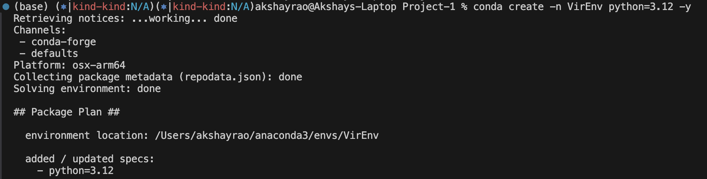
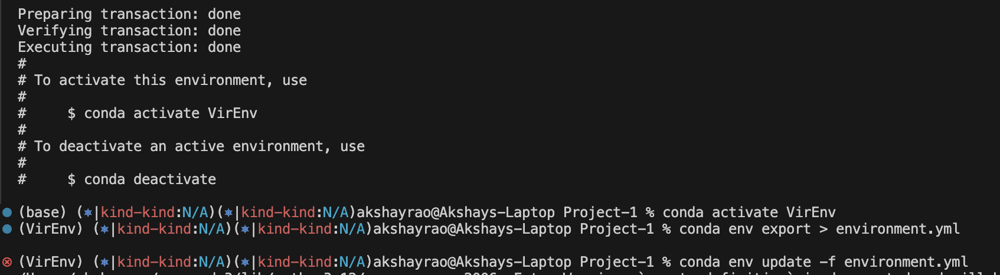
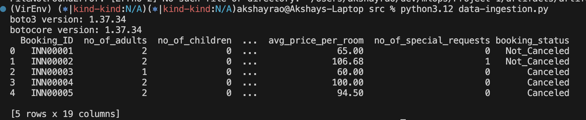

Project - 1 (Hotel Reservation Prediction)

- Platform and resources :- AWS's S3 bucket
- create a virtual env through conda.
- tools:- python, pandas, jypter Notebook, Flask, numpy

## Terraform 
- through terraform create private bucket and role called mlops.
- this mlops role has to permission to do operation on this data.
- attache a bucket policy so that this role only can access to this bucket.
- this is done so that the unauthorized person cannot acces the data in s3.

# env setup and insatll modules

# Data Ingestion output
