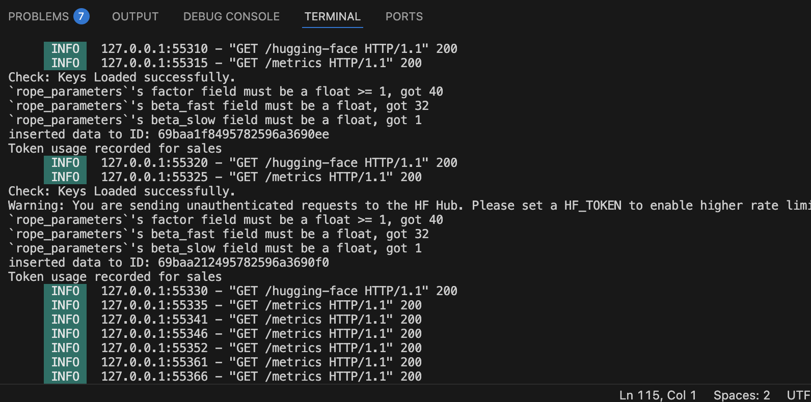
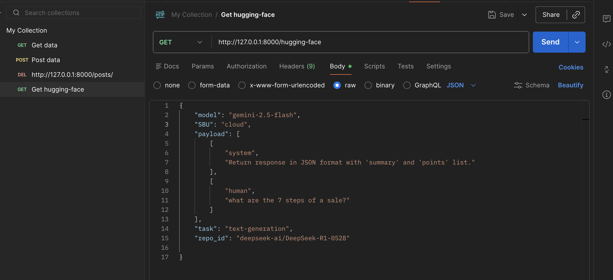
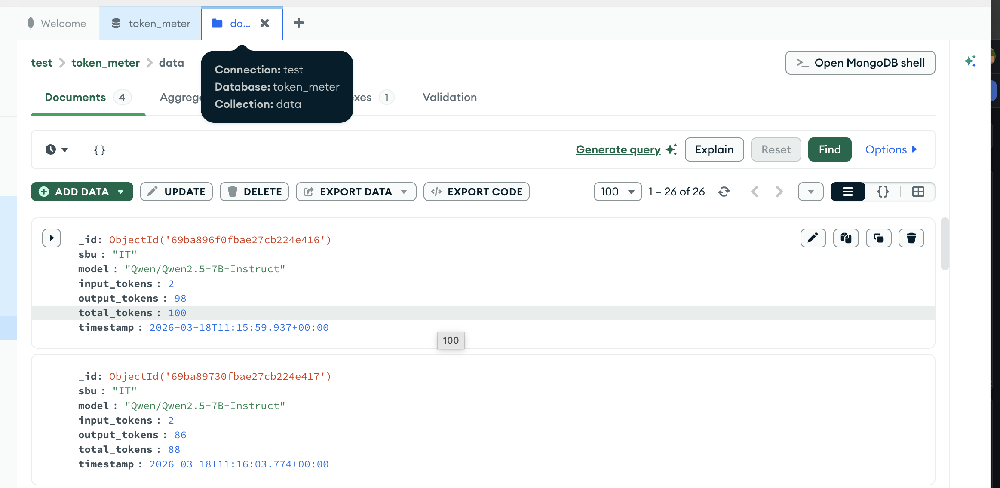
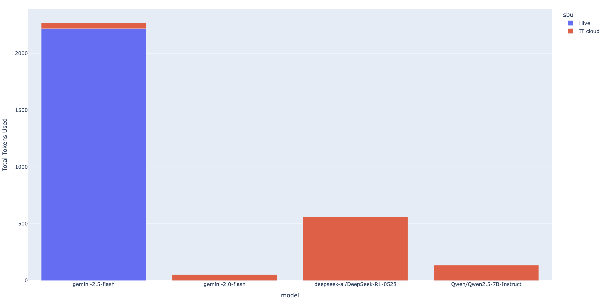
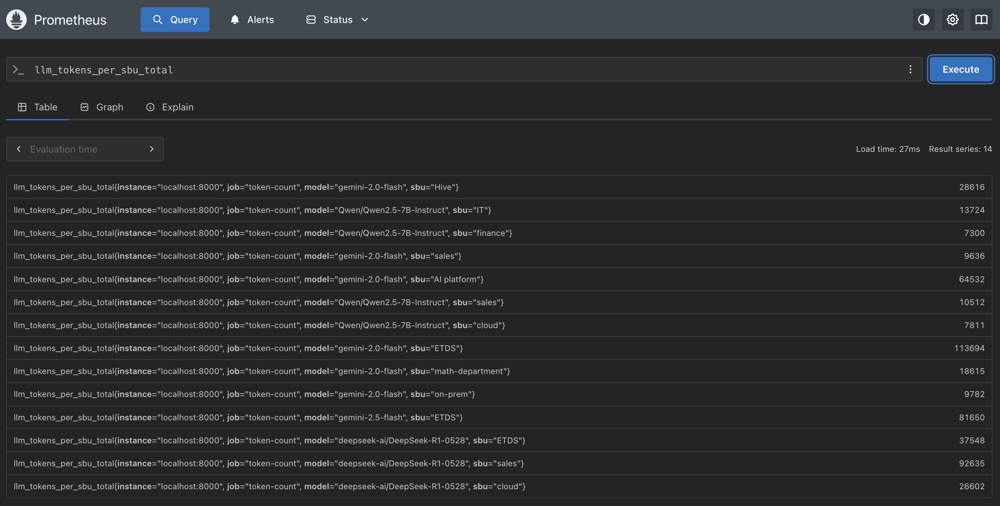
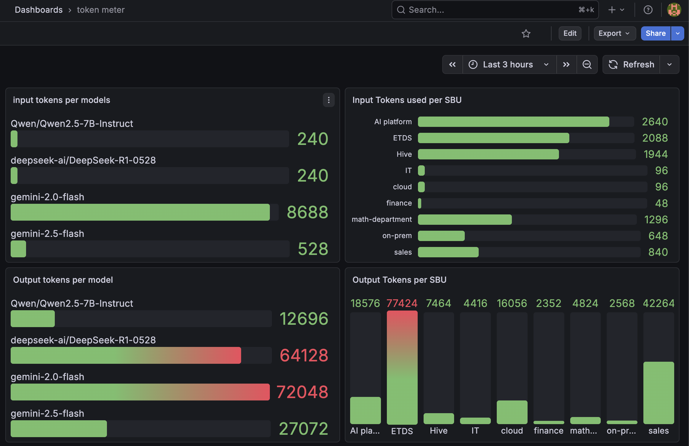
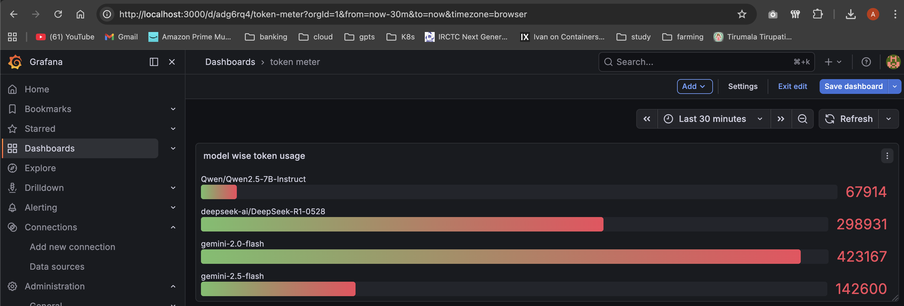
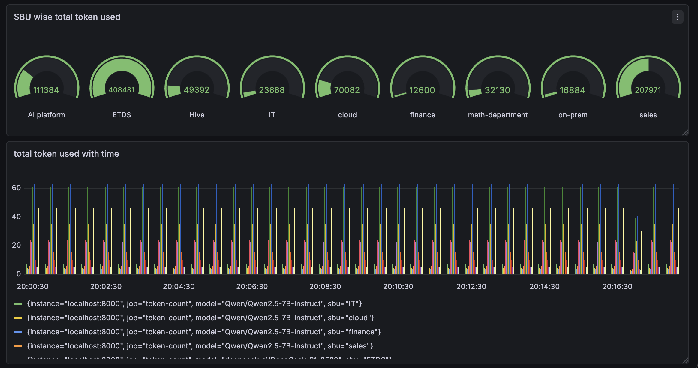

# Token Meter 🚦

**Monitor and Track LLM Token Usage Across Providers**

Token Meter is a lightweight API service built with **FastAPI** that tracks token consumption across multiple Large Language Model providers such as **Google Gemini** and **Hugging Face**.
It records token usage, model information, timestamps, and business units (SBU) into a structured JSON log and enables easy visualization through dashboards.

This project helps teams **monitor usage, analyze token consumption, and control LLM costs**.

---

# 🚀 Features

* 🔍 Track **input, output, and total tokens**
* 🤖 Support multiple providers

  * Google Gemini
  * Hugging Face models
* 📊 Store token metrics in a **JSON log**
* 📈 Easily build dashboards from logs
* ⚡ FastAPI-based REST API
* 🔐 Environment-based API key management
* 🧠 Supports both **simple prompts and chat messages**

---

# 🏗️ Architecture

<p align="center">
  
</p>

Flow:

Client Request → FastAPI → LLM Provider → Token Extraction → JSON Log → MaongoDB → Prometheus → Grafana

---

# 📂 Project Structure

```
token-meter/
│
├── main.py
├── token_usage.json
├── dashboard.py
├── requirements.txt
|-- mongodb.py
├── .env
│
├── images/
│   ├── architecture.png
│   └── bar-chart.png
|.  |-- Grafana.png
```

---

# ⚙️ Installation

### 1. Clone the repository

```
git clone https://github.com/aksrao1998/token-meter.git
cd token-meter
```

### 2. Create a virtual environment

```
python -m venv .tokMeter
source .tokMeter/bin/activate
```

### 3. Install dependencies

```
pip install -r requirements.txt
```

---

# 🔑 Environment Variables

Create a `.env` file:

```
GEMINI_API_KEY=your_google_api_key
hugging_face_api=your_huggingface_api_token
```

---

# ▶️ Running the API

Start the FastAPI server:

using FastAPI CLI:

```
python -m fastapi dev main.py
```


Open the API documentation:

```
http://127.0.0.1:8000/docs
```

---
# get request 


---

# 🧪 API Endpoints

## Gemini Endpoint

```
POST /gemini
```

Example request:

```
{
  "model": "gemini-1.5-flash",
  "SBU": "finance",
  "payload": "Explain Kubernetes",
  "temperature": 0.7
}
```

---

## Hugging Face Endpoint

```
POST /hugging-face
```

Example request:

```
{
  "repo_id": "google/gemma-2-2b-it",
  "task": "text-generation",
  "SBU": "analytics",
  "payload": "Explain Kubernetes",
  "temperature": 0.7
}
```

---

# 🧾 Token Logging

Every request generates a record in `token_usage.json`.

Example:

```
{
  "id": 1,
  "sbu": "finance",
  "model": "gemini-1.5-flash",
  "date": "2026-03-18",
  "time": "10:15:20",
  "Input Tokens Used": 20,
  "Output Tokens Used": 50,
  "Total Tokens Used": 70
}
```

---
# MongoDB logging data

---

# 📊 Dashboards

Token usage logs can be visualized using **Plotly**.

<p align="center">
  
</p>

Token usage logs can be visualized using **Prometheus loging**.

<p align="center">
  
</p>

Token usage logs can be visualized using **Grafana**.

<p align="center">
  
  
  
</p>

The Queries used in Grafana
* sum by (sbu) (llm_input_tokens_total)
* sum by (sbu) (increase(llm_input_tokens_total[1h]))
* sum by (sbu) (increase(llm_output_tokens_total[1h]))
* sum by (sbu) (llm_output_tokens_total)
* sum by (sbu) (llm_tokens_total)
* sum by (model) (llm_tokens_total)
* sum by (model) (llm_input_tokens_total)
* sum by (model) (increase(llm_input_tokens_total[1h]))
* sum by (model) (increase(llm_output_tokens_total[1h]))
* sum by (model) (llm_output_tokens_total)


Example metrics:

* Tokens per model
* Tokens per SBU
* Daily token usage
* Provider usage distribution

# 🧠 Supported Payload Formats

### Simple Prompt

```
{
  "payload": "Explain Kubernetes"
}
```

### Chat Format

```
{
  "payload": [
    ["system", "You are a sentiment analysis agent"],
    ["human", "I like ice cream"]
  ]
}
```

---

# 🔮 Future Improvements

* LLM cost estimation
* Multi-provider routing
* Redis caching
* Streaming responses
* Token cost alerts

---

# 🛠️ Tech Stack

* FastAPI
* LangChain
* Google Gemini
* Hugging Face
* Transformers
* Plotly
* Python
* Mongodb
* Grafana
* Prometheus

---
# 📜 License

MIT License

---

# 🙌 Contributing

Contributions are welcome!

1. Fork the repository
2. Create a feature branch
3. Submit a pull request

---

# ⭐ Acknowledgements

Inspired by the need to **track LLM usage and manage AI infrastructure costs** in production systems.

---

**Token Meter**
